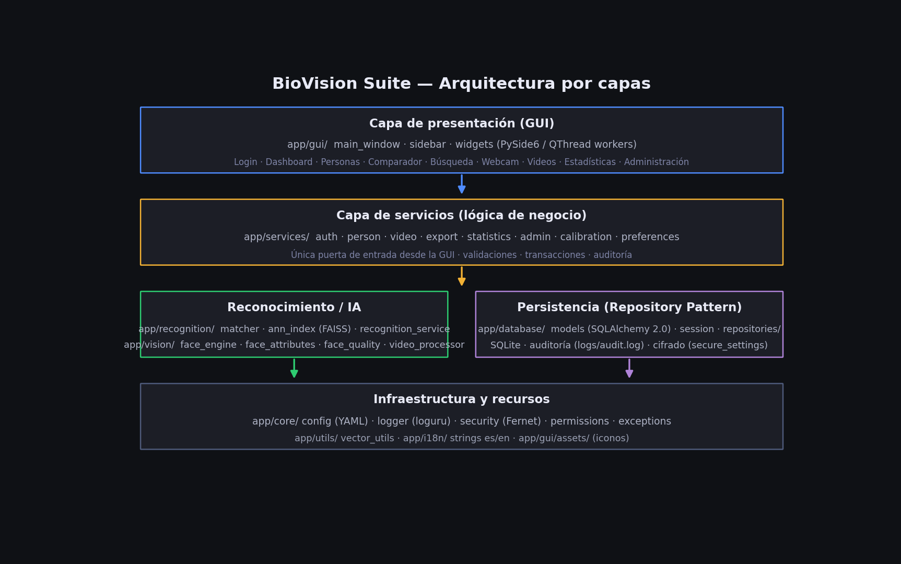
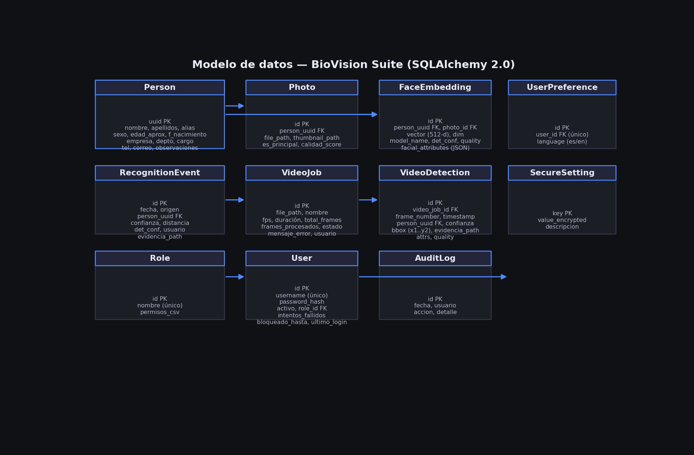

# Technical Manual — BioVision Suite

Technical reference document: architecture, design patterns, data model, key
algorithms, and configuration. Aimed at those who need to understand *how* the
system works internally (advanced support, technical audit, security
evaluation), not necessarily those who will modify the code — for that see the
*Developer Guide*.

---

## 1. Overview

BioVision Suite is a desktop application (PySide6) for facial registration,
search, comparison, and recognition, with **all processing local**: it does not
depend on external servers, paid APIs, or cloud services. AI runs on ONNX
Runtime (CPU or CUDA GPU), and persistence uses embedded SQLite.

## 2. Layered Architecture

The project follows a layered architecture with strict separation between UI,
business logic, AI, and data access:



| Layer | Folder | Responsibility |
|---|---|---|
| Interface | `app/gui/` | PySide6: windows, widgets, navigation, presentation. Contains no business logic nor direct DB access. |
| Services | `app/services/` | Business logic and orchestration. The only layer the GUI should invoke. |
| Recognition | `app/recognition/` | 1:1 comparison, 1:N search, multi-face recognition. |
| Vision | `app/vision/` | Wrapper over InsightFace/ONNX Runtime; detection, embeddings, image quality, video sampling. |
| Database | `app/database/` | ORM models, sessions, repositories (Repository Pattern). |
| Cross-cutting Core | `app/core/` | Configuration, logging, exceptions, security (encryption), permission catalog. Used by all layers. |

**Dependency rule:** each layer only knows the layers below it in the table.
The GUI never imports `app/database` or `app/vision` directly; it always goes
through `app/services`.

## 3. Design Patterns Applied

- **Repository Pattern** (`app/database/repositories/`): isolates
  SQLAlchemy queries from the rest of the application. Each repository exposes
  simple CRUD operations on an aggregate (e.g., `PersonRepository`,
  `VideoJobRepository`).
- **Service Layer**: each `*Service` in `app/services/` orchestrates one or
  more repositories and, when applicable, the vision/recognition engine. It is
  the sole entry point for the GUI.
- **Constructor dependency injection**: services receive the SQLAlchemy
  `Session` in the constructor (`PersonService(session)`), never creating it
  themselves. Makes testing with in-memory sessions easier.
- **Lazy singleton**: `FaceEngine` (app/vision/face_engine.py) loads AI
  models only once, on first real use, not on module import — avoids blocking
  GUI startup.
- **Simplified Unit of Work**: `get_session()` (app/database/session.py) is a
  context manager that opens a session, commits on clean exit, and rolls back
  on exception.
- **GUI / logic separation**: widgets in `app/gui/widgets/` build their own
  session via `with get_session() as session:` and call a service; they never
  execute SQLAlchemy queries directly nor call InsightFace directly.

## 4. Data Model



Relevant points of the model (`app/database/models.py`):

- **Person** is the root aggregate of the biometric record. `uuid` (not an
  auto-increment id) is its primary key, so it remains stable if synchronized
  across installations in the future.
- **Photo** and **FaceEmbedding** are separated intentionally: one photo may
  have more than one embedding (for example, if recalculated with another
  model), and an embedding always knows which photo it came from.
- **FaceEmbedding.vector** stores the 512-dimensional vector as raw `bytes`
  (`float32`), not as JSON, for space efficiency and read speed (see
  `app/utils/vector_utils.py`).
- **RecognitionEvent** unifies the recognition history regardless of source
  (`webcam`, `video`, `image`), allowing Dashboard and Statistics to query a
  single table.
- **VideoDetection** is more granular than `RecognitionEvent`: it stores
  `frame_number`, `timestamp_seg`, and the exact `bbox`, needed for video
  navigation. Each video detection generates *both* records: a `VideoDetection`
  (detail) and a `RecognitionEvent` (unified history).
- **User** and **Role** are independent of the `Person` model: a system user
  (who operates the app) is not the same as a person registered in the
  biometric database.
- **SecureSetting** stores `value_encrypted` as encrypted bytes (Fernet/AES);
  the plaintext value never touches disk.

## 5. Key Algorithms and Flows

### 5.1. Facial Recognition Pipeline

```
image/frame (BGR)
   → FaceEngine.analyze()          [InsightFace: SCRFD/RetinaFace + ArcFace]
   → list of FaceResult (bbox, landmarks, embedding 512-d, det_score)
   → face_quality.evaluate()       [sharpness, illumination, tilt]
   → (if enrollment) → save FaceEmbedding to DB
   → (if search) → RecognitionService._rank_1n()  [FAISS ANN index or exact linear]
```

### 5.2. Comparison and Decision Threshold

Similarity between two embeddings is calculated as **cosine similarity/distance**
(`app/utils/vector_utils.py`):

```
similarity = (a · b) / (‖a‖ · ‖b‖)         ∈ [-1, 1]
distance = 1 - similarity                  ∈ [0, 2]
```

A comparison is considered a **match** if `distance ≤
recognition.match_threshold` (default `0.40`, configurable in
`config/settings.yaml`). The percentage shown in the UI is a **calibrated
logistic transformation** of similarity (`matcher.similarity_to_percent`):
centered on the threshold, it returns ~50% right at the threshold, near 100%
well above and near 0% well below (the naive line `(sim+1)/2` would give ~50%
for unrelated faces and be misleading).

### 5.3. 1:N Search

`RecognitionService._load_gallery()` loads **all** embeddings from the
biometric database (with change-marker caching: only re-read when the set
varies). The search itself uses an **ANN index** (`app/recognition/ann_index.py`):

- An in-memory **FAISS** index is built (cosine = inner product over
  unit vectors). Below `recognition.ann_ivf_min_size` it uses `IndexFlatIP`
  (exhaustive, vectorized in C++: same result as linear scan but much faster);
  above it, `IndexIVFFlat` (real ANN) with conservative `nprobe` to keep
  recall high.
- The index is **cached per process** and rebuilt only when the gallery
  changes (marker of (count, max_id)).
- **Automatic fallback**: if `faiss-cpu` is not installed, if
  `recognition.ann_enabled` is `false`, or if the gallery is smaller than
  `ann_min_size`, exact linear search is used (`matcher.rank_candidates()`),
  with exactly the same result contract.

Duplicate rejection on enrollment (`_reject_duplicate`) remains an exact linear
scan (with cached gallery), since it must detect any biometric collision
without risking false negatives.

The index can be **persisted to disk** (`recognition.ann_persist: true` +
`ann_index_dir`) to avoid rebuilding the IVFFlat (k-means training) on each
startup, and its **recall** can be measured and calibrated with the integrated
benchmark (`app/recognition/ann_benchmark.py`, also accessible from
Administration → Recognition Parameters).

### 5.4. Video Analysis

`VideoService.analyze_video()` (app/services/video_service.py):

1. Opens the video with `VideoReader` (OpenCV) and validates extension/existence.
2. Iterates through the video **sampling** 1 of every
   `video.sample_interval_frames` frames (default 15 → ~every 0.5 s at 30 fps),
   not every frame. The interval can be overridden per call (`sample_interval`)
   for the GUI sampling quality selector.
3. Each sampled frame is **resized** to `video.max_processing_width` before
   passing to the detector (performance); the resulting bbox is **rescaled**
   back to original size (`scale_bbox()`) to crop sharp evidence from the
   unresized frame.
4. Each recognized face generates a `VideoDetection` + a `RecognitionEvent`,
   and optionally an evidence crop in `data/video_evidence/`.
5. Progress is reported via callback every 5 samples (avoids flooding the UI
   with updates).
6. `VideoService.export_detections(job_id, path, fmt)` exports detections to
   **CSV** or **Excel** (`fmt="excel"`); Excel has two sheets — *Summary*
   (KPIs and detected persons) and *Detections* (colored headers, borders,
   alternating rows, status highlighting, frozen rows, and automatic column
   filtering).

### 5.5. Authentication and Automatic Lockout

`AuthService.authenticate()` (app/services/auth_service.py):

- Passwords are stored with **bcrypt** (`hash_password`/`verify_password`),
  never in plaintext.
- After each failed attempt `User.intentos_fallidos` is incremented; when
  `security.lockout_attempts` is reached, `User.bloqueado_hasta = now +
  security.lockout_minutes` is set. While that date has not passed, login is
  rejected **even with the correct password**.
- A successful login resets `intentos_fallidos` and `bloqueado_hasta`.

### 5.6. Role-Based Permissions

`Role.permisos_csv` stores a comma-separated list of permissions (see
`app/core/permissions.py`), or `"*"` as wildcard for "all permissions".
`AuthService.has_permission()` decides whether a user can perform an action;
`MainWindow` uses the same calculation to decide which sidebar buttons to show
(`NAV_PERMISSIONS` in `app/gui/main_window.py`).

### 5.7. Sensitive Configuration Encryption

`app/core/security.py` uses **Fernet** (AES-128-CBC + HMAC-SHA256, from the
`cryptography` library) with a symmetric key generated locally on first use
(`config/.secret.key`, outside version control). A value encrypted with this
key cannot be decrypted with any other (verified in `tests/test_auth_and_admin.py`).

### 5.8. Session Lock on Inactivity

`MainWindow` installs an application-level `eventFilter` that records the
timestamp of the last interaction (mouse movement, click, key press). A
`QTimer` checks every 30 seconds whether `security.session_timeout_minutes`
has been exceeded; if so, the login screen is shown again in "lock mode"
(fixed user, only asks for password).

## 6. Configuration Reference (`config/settings.yaml`)

| Section | Key | Meaning |
|---|---|---|
| `vision` | `detector_model` | InsightFace model package (`buffalo_l` by default) |
| `vision` | `ctx_id` | `-1` = CPU, `0` = first CUDA GPU |
| `vision` | `min_face_confidence` | Minimum detection confidence to accept a face |
| `recognition` | `match_threshold` | Maximum cosine distance to consider a match |
| `recognition` | `top_k_results` | How many candidates to return in 1:N searches |
| `video` | `sample_interval_frames` | Every how many frames one is analyzed |
| `video` | `max_processing_width` | Maximum width before resizing for detection |
| `security` | `lockout_attempts` / `lockout_minutes` | Account lockout policy |
| `security` | `session_timeout_minutes` | Minutes of inactivity before locking session |
| `storage` | `photos_dir`, `thumbnails_dir`, `evidence_dir` | File storage paths |

## 7. Logging and Auditing

`app/core/logger.py` configures **loguru** with three outputs:

1. Console (level `INFO` by default).
2. `logs/app.log` — general application log, with rotation.
3. `logs/audit.log` — only audit-marked events (`audit_logger.info(...)`):
   person and user creations/deletions, logins, lockouts, exports, restores,
   DB cleanup. 365-day retention. Visible from *Administration → Audit* in the
   app itself.

## 8. Automated Tests

The project includes **101 tests** (`pytest tests/`) covering the service and
data layers without depending on PySide6 or real AI models (replaced by test
doubles when needed):

| File | Covers |
|---|---|
| `test_database_and_matcher.py` | Repositories, vector serialization, matcher |
| `test_video_service.py` | Frame extraction, video analysis orchestration |
| `test_statistics_and_export.py` | Aggregate queries, charts, CSV/Excel/JSON/PDF/SQLite export |
| `test_auth_and_admin.py` | Authentication, lockout, permissions, users, roles, encryption, cleanup, restore |
| `test_calibration.py` | Facial analysis calibration, age/gender, photo re-analysis |

## 9. Known Limitations

- 1:N search with ANN index (FAISS) when `faiss-cpu` is installed,
  `recognition.ann_enabled` is `true`, and the gallery exceeds `ann_min_size`;
  otherwise exact linear search is used (same result contract). `IndexIVFFlat`
  mode is approximate: it is advisable to calibrate `ann_nprobe` with the
  built-in recall benchmark on very large databases.
- "Extended facial analysis" uses heuristic geometric and texture classifiers
  over MediaPipe FaceMesh (no neural classifiers trained for glasses/beard/mask);
  they are reasonable approximations on sharp frontal shots, not a biometric
  verdict. Thresholds can be calibrated in *Administration → Facial Calibration*.
- Database restore requires manually restarting the application (no hot-swap of
  the engine at runtime).
- Permissions are per whole module, not per specific action within a module
  (see Roadmap in README).
